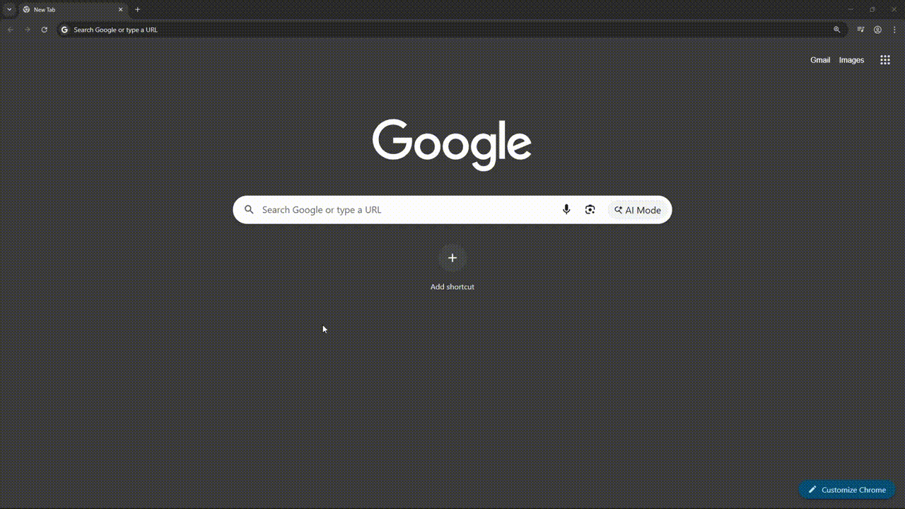

# Wiki Random API

My own implementation of the [Wikipedia](https://www.wikipedia.org/) random article http endpoint. Built to directly address my own issues with [Wikipedia's offical random article search](https://en.wikipedia.org/wiki/Wikipedia:Random) which often returns stubs, disambiguation pages, or articles outside my interests

Wiki-random is a lightweight, stateless HTTP API that redirects the user to a random, readable Wikipedia article based on configurable parameters.

> [!IMPORTANT]  
> Wiki-random is designed to be used only by humans and will not exceed mediawiki's api limits under normal use. See [Disclaimer](#disclaimer).

---

# Overview
## Endpoints

| Method | Slug | Description |
| --- | --- | --- |
| GET | /api/wiki-random | Redirects (`302`) to a random Wikipedia article |
| GET | /api/wiki-random/health | Health check endpoint, returns JSON status |

## Query Parameters

| Parameter | Type | Default | Description | Use |
| --- | --- | --- | --- | --- |
| categories | string (CSV) | [Categories default](#ADD_DEFAULT_CATEGORIES_HERE) | Comma-separated list of Wikipedia categories to source articles from | `?categories=science,technology,art` |
| min_size | integer | 6000 | Minimum article size in bytes | `?min_size=8000` |
| evergreen | boolean | false | Attempts to filter out time-sensitive or list-style articles | `?evergreen=true` |
| exclude | string (CSV) | none | Comma-separated list of keywords to exclude from results | `?exclude=politics,election` |

> [!TIP]
> Excessively strict filters may lead to higher probability of repeats or failures to find adequate articles.

## Examples

Use all parameters together in any combination for full customization of the randomized query:
https://logandwaters.com/api/wiki-random?categories=art,history&min_size=8000&evergreen=true&exclude=war,conflict

<b>Click here for more examples</b>

- Health endpoint json response: https://logandwaters.com/api/wiki-random/health
- Default 302 redirect to a random Wikipedia article: https://logandwaters.com/api/wiki-random
- Define custom categories for a random wikipedia article: https://logandwaters.com/api/wiki-random?categories=science,technology
- Define custom minimum article size for a random wikipedia article: https://logandwaters.com/api/wiki-random?min_size=1000
- Use the evergreen filter for a more readable random wikipedia article: https://logandwaters.com/api/wiki-random?evergreen=true
- Exclude specific keywords from the returned random wikipedia article: https://logandwaters.com/api/wiki-random?exclude=politics,election

---

# Development & Deployment

Looking to run your own instance of the wiki-random API? See [new/README.dev.md](new/README.dev.md) for development and deployment notes.

---

# Made Possible By
- [Wikipedia](https://www.wikipedia.org/) - the free encyclopedia that powers this API.
- [MediaWiki API](https://www.mediawiki.org/wiki/API:Main_page) - for querying Wikipedia's vast article database.
- [Wikipedia-API Python Library](https://pypi.org/project/Wikipedia-API/) - for simplified interaction with Wikipedia's API in Python.

---

# Disclaimer

> [!IMPORTANT]  
> This project is not affiliated with or endorsed by the [Wikimedia Foundation](https://wikimediafoundation.org/).

Use of this API is subject to the terms of service of the MediaWiki API and Wikipedia. This API is provided for free and "as is" without warranty or guarantee of any kind. This API was made explicitly to never burden the MediaWiki API and is generously rate-limited within the application and by CDN at the public endpoint; Deployed for public use at: https://logandwaters.com/api/wiki-random, access can be revoked at any time without notice and is not meant for automated traffic or high-throughput use. Throttles are more than generous for intended, human access only. By using this API, you agree to comply with Wikipedia's [Terms of Use](https://foundation.wikimedia.org/wiki/Terms_of_Use) and [API Etiquette](https://www.mediawiki.org/wiki/API:Etiquette).

---

## License

This project is licensed under the  
**Creative Commons Attribution-NonCommercial 4.0 International (CC BY-NC 4.0)** license.

You are free to:
- Use and modify the code for personal or educational purposes
- Share and collaborate on non-commercial forks

You may not:
- Use this project or derivatives for commercial purposes
- Offer it as a paid service or product

Full license text: https://creativecommons.org/licenses/by-nc/4.0/